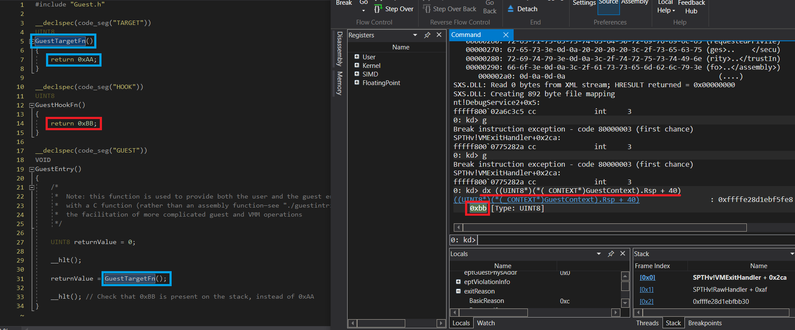

# EPT Identity Branch

This branch demonstrates several concepts which make use of our prior knowledge of the EPT paging mechanism in order to manipulate guest software. The pervious branch (EPT) demonstrated extremely granular identity mappings in our EPT. This branch, as the name suggests, performs identity mapping of all of the physical memory on the guest target machine; primarily by utilizing 2MB large page mappings (PDEs). Helper routines have been added to obtain memory types for these large page PDEs via MTRRs, selectively split PDEs, and perform TLB shootdowns. Additionally, to demonstrate control over guest software using our system identity mappings, our VMM now demonstrates a technique known as EPT *splitting*.

EPT splitting, as seen in the screenshot below, involves changing the mapping of a PTE depending on the type of access that is requested by guest software. For instance, if a default PTE has the read, write, and execution bits set, one may end up removing the execution bit on a page of code. This would cause the hypervisor to break into your predefined the exit handler upon execution reaching your target page. At this point, a different page of code may be mapped in place of the original code, this time with only the execute permission bit set. This process would then be repeated upon read/write accesses to the newly-placed execute-only PTE. The result of these operations is a page of hidden code that is not detectable by the guest software; as all read operations on this code region would return the original, now exclusively read/write mapping instead of the modified executable mapping (and vice versa).

[Compare this branch to it's base \(EPT\)](https://github.com/calware/HV-Playground/tree/EPT...EPTIdentity)

# Changes From the EPT Branch
...
