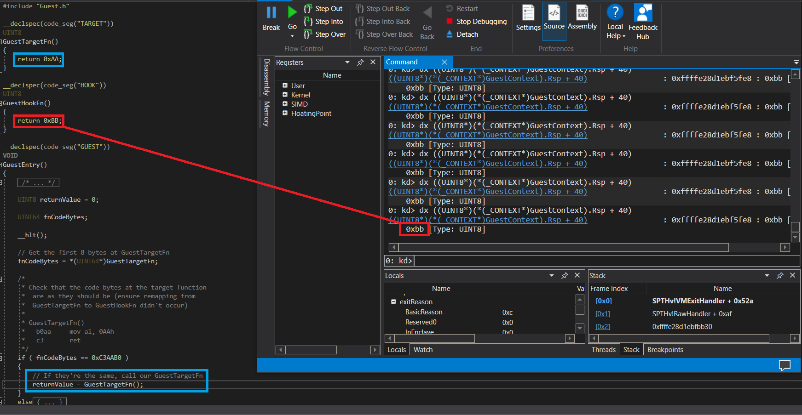

# EPT Branch

This branch demonstrates the setup and runtime environment in which a guest in governed not only by the boundaries of our previous VMX operations, but additionally by behavioral modifications imposed by a function of Intel's VT-x called Extended Page Tables (EPT).

[Compare this branch to it's base \(GuestState\)](https://github.com/calware/HV-Playground/tree/GuestState...EPT)



In order to demonstrate the EPT translation mechanism, my code inserts the relevant paging entries into the EPT, allocating new tables where required, for every provided 4KB region of guest data. The techniques used in this branch to insert EPT entries is very granular, and something I haven't seen performed in other public projects. For that reason, I've included a (rather) complete explanation of the relevant technologies down below. If you're already familiar with segmentation and paging, but not familiar with the idea of EPT, you can skip below to the section titled "Extended Page Tables (EPT)".

## Segmentation, Paging, and Extended Page Tables

To fully understand the elements that go into utilizing Intel's Extended Page Tables, you must first begin with the memory concepts of the x86 family of instruction set architectures (ISAs); more specifically Intel's 32-bit version, IA-32. Introduced in 1985, the Intel 80386 was the first Intel chip to have implemented the IA-32 ISA. The functionality of the 80386 was derived from two prior Intel chips, both of which contributed to important advancements within the realm of memory segmentation. The 8086 introduced a primitive version of segmentation, further advanced by the 80286 four years later, adding separate segments for the data, code, and the stack, applying the traditional [base-bounds pair](https://en.wikipedia.org/wiki/Base_and_bounds) to these segments, and the advent of privilege levels seen in a processor mode dubbed [protected mode](https://en.wikipedia.org/wiki/Intel_80286#Protected_mode). The 80386, in addition to extending the architecture from 16-bits to 32-bits, also added an on-chip memory management unit to facilitate paging. Paging, as you may guess, is a concept that is foundational to our Extended Page Tables.


Before the dawn of segmentation, Operating systems such as [CP/M](https://en.wikipedia.org/wiki/CP/M) running on an Intel 8080 would load binaries at a pre-set address, storing all of the program's code and data in one segment. This design decision, while simplistic, was not without it's problems. The binaries utilized by early versions of CP/M carried a maximum file size, and would be allowed unrestricted access to all of the memory on the system. The latter of these problems was not the fault of CP/M, though, but rather of the underlying processor. In addition to the lack of memory protections, the 8080 allowed for an address width of 16-bits. This meant that systems built on the 8080 only supported up to 64KB of memory. While four times more than that of the 8008, times were changing, and newer operating systems were demanding far more than 64KB of memory. The 8086 was meant to address the need for additional memory by providing a 20-bit address width (allowing access up to 1MB of memory), with an addressing scheme known as segmentation. This primitive form of segmentation provided four segment registers (`CS`, `DS`, `ES`, and `SS`), which would provide a 16-bit base address that, after being shifted by four bits (purposely to establish a 20-bit address width) would be combined with a 16-bit offset to allow each of these individual segments to index up to 64KB of memory.


*(8086 Family User's Manual - Mnemonics © Intel, 1978)*


*(8086 Family User's Manual - Mnemonics © Intel, 1978)*


*(8086 Family User's Manual - Mnemonics © Intel, 1978)*

As time went on, and with the introduction of the 80286, there were additional changes made to the segmented addressing scheme originally introduced by the 8086. Most notably, the 80286's protected mode established boundaries on memory accesses by preventing overlapping of segments, and assigning privilege levels to these segments; so as to prevent unauthorized access to sensitive code or data. Further, the 80286's protected mode increased the address width from 20-bits to 24-bits (allowing access to up to 16MB of memory). An important note here is that this extension to the address width was not created by increasing the aforementioned four shifted bits, as seen in the 8086. Instead, each of the 16-bit segment registers on the 80286 were used to hold an index into a table of [segment descriptors](https://en.wikipedia.org/wiki/Segment_descriptor) containing 24-bit base addresses, to which the offset is added directly. These segment descriptors are derived from the newly implemented [Global Descriptor Table](https://en.wikipedia.org/wiki/Global_Descriptor_Table) and/or [Local Descriptor Table](https://en.wikipedia.org/wiki/Global_Descriptor_Table#Local_Descriptor_Table). The 80286 also introduced the idea of *privilege-levels* (also referred to as privilege *rings*) which could be used to provide access checks on instructions and memory. These privilege-levels ranged from zero to three, with zero being the most privileged and generally reserved for system critical code (such as the operating system's kernel). Last but not least, the 80286 was responsible for implementing *tasks*, which would later become the basis for the processes you know today.


*(80286 and 80287 Programmer's Reference Manual - © Intel Corporation 1987)*


*(80286 and 80287 Programmer's Reference Manual - © Intel Corporation 1987)*

Again, some years went by, and along came the 80386. And with the 80386, came some very big changes. Yet again, the address width was increased from 24-bits to 32-bits (allowing access to up to 4GB of memory), and an on-chip memory management unit (MMU) was added. Back in the realm of segmentation, two more segments (`FS` and `GS`) were added, with no processor defined purpose. One of the most important things to understand about the 80386 was that programs had the ability to implement a [flat memory architecture](https://en.wikipedia.org/wiki/Flat_memory_model). While programs could not effectively turn off segmentation, they could instead achieve the same outcome by initially loading segment registers with selectors that encompassed the entire 32-bit linear address space. With these modifications to the segmentation mechanism, programs gained the ability to view and manipulate their address space as one contiguous unit.


*(Intel 80386 Programmer's Reference Manual 1986 - © Intel Corporation 1987)*


*(Intel 80386 Programmer's Reference Manual 1986 - © Intel Corporation 1987)*

Earlier you'll recall I mentioned the 80386 implemented a MMU. This MMU, unlike the external ones supported by the 80286, allowed for a memory translation mechanism known as paging. Paging is a technique in memory management which equips processors with the ability to independently provide abstractions on (virtualize) the memory exposed to underlying operating systems; and the applications therein. Processors with MMU components provide underlying software with memory in the form of *pages*. The processor also reserves the ability to *page out* certain pages to disk when they're not actively used, thereby temporarily freeing up memory. While sizes for these pages can vary between systems, most modern operating systems define pages as 4KB contiguous chunks of memory. These pages are then accessed by indexing a series of tables known as *page tables*, which are also generally 4KB contiguous chunks of memory. It's also important to know that each of these paging allocations generally fall on a 4KB boundary, so as to clear the last 12-bits. As you can imagine, in order to then access one of these pages, you must provide the processor with a series of indices into these paging tables, along with a final, larger index which specifies where in the resulting 4KB page your target data is located. This sequence of indices is known as a *virtual address*. It should be noted now that the addresses held within page tables—be they addresses of other tables, or actual data—must not be virtual addresses, as then an infinite number of translations would occur. Instead, the addresses pointed to by page tables are actual, non-virtual addresses of memory, commonly referred to as *physical addresses*. As seen briefly in the image above, there is a *linear address*—which is in this case analogous to a virtual address—split into three parts. The first two, shown as `Dir` and `Page` represent the portions of the virtual address which would index into page tables, while the final `Offset` represents an offset into a 4KB page mapping actual data. This is expanded on further in the image below.


*(Intel 80386 Programmer's Reference Manual 1986 - © Intel Corporation 1987)*

Moving forward, we're going to refer to the `Dir` and `Page` bits (seen above) as the *Page Directory Table* and the *Page Table*, respectively. As you can see, there are a total of 10-bits allocated for indexing into the Page Directory Table (PDT), and the Page Table (PT), with the final 12-bits used for indexing into our final page entry, also known as a Page Table Entry (or PTE). This makes for a total of 32-bits, the total size of our virtual address. Since we know that each resulting PTE maps 4KB of data (more precisely 4096 bytes), we understand that 12-bits makes for a perfect offset into this page; allowing us to index data within our PTE at 1-byte granularity—meaning we can index each byte in our 4KB PTE. However, regardless of the fact that our page tables (both our PDT and PT) are also allocated as 4KB regions, we do not need to index them at 1-byte granularity. Rather, in order to continue our paging translation, we only require the physical address of our next paging table or final PTE. However many bytes are required to represent the address of our next entry is exactly how many bytes of granularity is required when indexing paging tables. And since both page tables and final PTEs are aligned on a 4KB boundary, we don't need the last 12-bits, as they'll always be zero. At this point it may be easy to assume that, as the last 12-bits could be ignored, you would only require 20-bits of the overall 32-bit addresses to point to the next paging structure; but this isn't exactly the case. The 80386 will do exactly that, and ignore the final 12-bits when translating the address of the next page table or final PTE. However, the 80386 does not ignore these final 12-bits outside of calculating the next page address, and instead puts them to use as page-specific property values. These property values are used to signify how the system may access the memory this paging entry points to (via the current privilege-level, or requested operation), if the memory has been accessed recently, or whether the page is present or must be *paged in* from the disk. Since these 12-bits are put to use as page-specific property values, the 12-bits is necessary to support accessing the desired page, so the full 32-bits is required. A 4KB page has 1024 4-byte (32-bit) sequences, and thus to index each page table at 4-byte granularity you must provide 10-bits (`2^10 = 1024`), which is the size required by our PDT/PT fields of the virtual address. The structure of each paging entry (regardless of if they point to actual data or another table) is seen in the image below.


*(Intel 80386 Programmer's Reference Manual 1986 - © Intel Corporation 1987)*


*(Intel 80386 Programmer's Reference Manual 1986 - © Intel Corporation 1987)*

You'll notice in the translation diagram seen above, that there is a variable called `CR3`. This is in fact a *control register* introduced in the 80386 which is used to point to the initial PDT. You might be thinking now that since each paging table allows for 1024 entries, and since each PTE is 4KB, that the processor should only require one PDT; as it is capable of indexing the entire 4GB system address space. And while this *is* correct, there is a clear benefit in providing several PDTs within the realm of address-space isolation. But before we can talk about address-space isolation, there's something you must understand about all of the processors mentioned in this article: not a single one of them supports multithreading. Multithreading is a concept that has not yet been introduced on Intel processors, and wouldn't in fact be introduced until the Pentium 4s came out, nearly 17 years after the 80386 launched. The idea of *tasks* had been around since the 80286 (mentioned previously), which do share similarities to the processes of today. So, for the sake of moving forward, you can think of the tasks of the past as single-threaded processes. Since most non-privileged tasks do not require access to a full view of system memory, a new control register, `CR3`, was put in place to provide each running task with a separate PDT that it could use to access the virtual address space relevant to it's operations.


*(Source: [Flickr.com](https://www.flickr.com/photos/tamasrepus/3431362418))*

Four years after the 80386 was introduced to consumers, HP began to become concerned about the advancements of other instructions sets; more specifically [RISC](https://en.wikipedia.org/wiki/Reduced_instruction_set_computer). To address these concerns, HP got together with Intel and began exploring options for future ISA designs. These developments would eventually become the IA-64 architecture, still seen in Itanium processors to this day. However, this likely isn't the ISA your current machine is running on. The reason for this is that, some time after IA-64 debuted, AMD announced an alternative to the architecture, designed to extend the already widely-accepted x86 architecture with several benefits relative to that of IA-64. This architecture, named *AMD64* (also known as x86-64, Intel 64, and IA-32e), was originally implemented in AMD's Opteron processor in 2003. It was later implemented by Intel, and is now in all likelihood the ISA your processor is using.

AMD64 introduced a number of changes to the pervious x86 architecture. Most importantly, it introduced a new processor mode (with two new sub-modes), it extended the current paging translation mechanism to utilize four page tables, and it supported a vastly larger amount of memory with 64-bit addressing. This new processor mode, named *long-mode*, is an extension to our 80386's protected mode, and includes a very important sub-mode called *64-bit mode*. This sub-mode supports a full range of 64-bit processor features, and **supports only a flat address space**. In 64-bit mode, there is a single address space which is host to code, data, and the stack. The base of each of these segments will always be zero. You may notice the similarities to the aforementioned 80386 processors, where protected mode could be utilized to produce a similar flat address space.


*(AMD64 Architecture Programmer's Manual, Volume 1: Application Programming - © 2013 – 2017 Advanced Micro Devices Inc.)*

At this point, you know all you need to about the history of paging and segmentation. Shortly, I wish to describe some of the changes to the page table entries, and virtual address structure seen in modern Intel processors, as well as demonstrate how one could go about translating a virtual address to a physical address using a tool like WinDBG/KD. 


*(AMD64 Architecture Programmer's Manual, Volume 1: Application Programming - © 2013 – 2017 Advanced Micro Devices Inc.)*


*(AMD64 Architecture Programmer's Manual, Volume 1: Application Programming - © 2013 – 2017 Advanced Micro Devices Inc.)*

As you can see from the diagrams above, not only are there more tables, but the index sizes for each of these tables have been decreased. The reason for this is pretty simple: the granularity has increased from 4-bytes to 8-bytes; as per the 64-bit address. There are several new tables to cover, each of which now holds 512 8-byte entries. First, we have the Page Map Level-4 (PML4) Table, which then maps a Page Directory Pointer Table (PDPT), which maps our previous PDT, PT, and final PTE. This makes for a total of 36-bits of table indices, along with a final 12-bit index into the 4KB PTE which maps actual data. The total usable size of a virtual address or page table entry is 48-bits—sometimes seen with an additional 16-bits of unused space at the top (bits 48 to 63) of the virtual address.

### Manually Performing Page Translation

Now it's time for a short demo. In addition to giving a real world example for the ideas expressed above, performing a manual translation of virtual to physical addresses will become integral to the developmental process of a hypervisor implementing Intel's EPT. The idea is to take the output from the example program shown below, and demonstrate the locating and subsequent modification of a variable in physical memory. Let's begin with the code of our example application

```C
#include <stdio.h>
#include <stdint.h>

int main()
{
  uint8_t iVal = 0xAA;

  printf("iVal virtual address: %p\n\n", &iVal);

  while ( 1 )
  {
    printf("iVal = 0x%X\n", iVal);
    getchar();
  }

  return 0;
}
```

This program, when executed on our VM, produces the following output.


As you can see, our `iVar` variable is located at virtual address `000000093313FBE0`, and contains `0xAA` as seen in the source code above. Now we need to obtain some information on the target process. Chiefly, we're going to need the PML4 pointer to begin translating the virtual address of `iVar`. Remember how `CR3` pointed to the PDT for the current task in the 80386? Similarly, now we have a `CR3` that points to a PML4 for the current process. And since we no longer have task-specific contexts, these `CR3` values are now specific to the current thread that is executing within the target process. The value held within `CR3` will be constant across all of the threads in the target process.


Another way to get the PML4 address for a target process is by obtaining the processes `DirBase` (also called the Directory Table Base), seen in the screenshot above. In this case, our `DirBase` is `09a55002`, a **physical address** which points to the base of the target process's PML4 table.

So, to summarize our information so far:
  - Target Virtual Address: `000000093313FBE0`
  - PML4 Base Address: `09a55002`
  - PML4E Value:
  - PDPT Base Address:
  - PDPTE Value:
  - PDT Base Address:
  - PDE Value:
  - PT Base Address:
  - PTE Value:
  - Target Physical Address:

Now let's split our virtual address into the relevant pieces to index our page tables.

```
0: kd> .formats 000000093313FBE0
  ...
  Binary:  00000000 00000000 00000000 00001001 00110011 00010011 11111011 11100000
  ...
```

```
       16-bits        9-bits      9-bits     9-bits      9-bits       12-bits
      (unused)        (PML4)      (PDPT)      (PDT)       (PT)         (Page)
 +----------------+-----------+-----------+-----------+-----------+--------------+
  0000000000000000  000000000   000100100   110011000   100111111   101111100000
 +----------------+-----------+-----------+-----------+-----------+--------------+
63              48:47       39:38       30:29       21:20       12:11            0
```

As you can see, there are 16-bits of unused space up top, the next 9-bits are the PML4 index, the PDPT index, the PDT index, the PT index, and finally the page index. 

Now we're going to obtain the PML4 entry (PML4E) value which will point to our PDPT base. The process for obtaining the PML4E is exactly the same as obtaining the PDPT entry (PDPTE), PDT entry (PDE), or PT entry (PTE). First, you start with the table base address. In this case, the base address of our PML4 table (seen in the `DirBase` value above) is `09a55002`. Next, since we know from earlier that each of our paging allocations—be they page tables or PTEs mapping actual data—are 4KB aligned allocations, we can take off the last 12-bits. Recall from earlier that these final 12-bits are not used for address the next paging entry, and are instead used as page-specific property values. You can think of clearing the final 12-bits as just taking off the last 3 *digits* of the hexadecimal table base address. In this case, our PML4 base address goes from `09a55002` to `09a55000`. Next, you simply apply your index to the base address. Remember that we're indexing in terms of 8-byte granularity. If your PML4 index is (decimal) four, you're indexing the fourth 8-byte sequence, so you have to multiply your index by eight before adding it to your base address. You can simplify this process in WinDBG because of the ability to specify a complex expression as an address value. This express will become simplified, and then read form accordingly. Additionally, you can utilize value prefixes to alert WinDBG that a value in this complex expression is binary (`0y`), and use an exclamation point before the expression to specify a resulting physical address (instead of a virtual one). Finally, we'll use the `dq` command to read a quadword value (8-bytes), and request only one 8-byte entry (via `L1`). An expression demonstrating these ideas is seen below.

```
0: kd> !dq 09a55000 + (0y000000000 * 8) L1
# 9a55000   8a000000`2a1e2867
```

To summarize the information obtained so far:
  - Target Virtual Address: `000000093313FBE0`
  - PML4 Base Address: `09a55000`
  - PML4E Value: `8a000000 2a1e2867`
  - PDPT Base Address:
  - PDPTE Value:
  - PDT Base Address:
  - PDE Value:
  - PT Base Address:
  - PTE Value:
  - Target Physical Address:

It should be said, you don't have to organize your expressions this way. You could choose, instead, to convert the binary value to a (perhaps) more familiar hexadecimal value, and then multiply by 8, and add the index manually. Demonstrating that in the case of our PML4 would be unnecessary though, as our index is zero.

The base address of our PDPT can now be seen above in the output, `8a000000 2a1e2867`. Often times, to move forward with a value like this, you can simply take off the top 32-bits of the value (everything before the \` or space). Sometimes, the physical address will exceed 32-bits. Regardless, you want to ignore all of the bits which don't correspond to the address of the next paging entry (bits 12 to 36—sometimes larger depending on your machine's physical address width), and again slice off the final 12-bits. This results in a PDPT base address of `2a1e2000`. This address is then indexed the same way, shown below.

An example of manually obtaining and calculating the base address of our PDPT:
```
0: kd> .formats 0y000100100
Evaluate expression:
  Hex:     00000000`00000024
  Decimal: 36
...
0: kd> ? 2a1e2000 + (24 * 8)
Evaluate expression: 706617632 = 00000000`2a1e2120
0: kd> ? 2a1e2000 + (0n36 * 8)
Evaluate expression: 706617632 = 00000000`2a1e2120
```

And using our address expressions the same was as before:
```
0: kd> !dq 2a1e2000 + (0y000100100 * 8) L1
#2a1e2120   0a000000`21463867
```

To summarize the information obtained so far:
  - Target Virtual Address: `000000093313FBE0`
  - PML4 Base Address: `09a55000`
  - PML4E Value: `8a000000 2a1e2867`
  - PDPT Base Address: `2a1e2000`
  - PDPTE Value: `0a000000 21463867`
  - PDT Base Address:
  - PDE Value:
  - PT Base Address:
  - PTE Value:
  - Target Physical Address:

Again, we get the PDT base address the same way; `0a000000 21463867` becomes `21463867` which becomes `21463000`. And we index this base address the same was as before to obtain our PDE, as seen below.

```
0: kd> !dq 21463000 + (0y110011000 * 8) L1
#21463cc0   0a000000`7a0f4867
```

To summarize the information obtained so far:
  - Target Virtual Address: `000000093313FBE0`
  - PML4 Base Address: `09a55000`
  - PML4E Value: `8a000000 2a1e2867`
  - PDPT Base Address: `2a1e2000`
  - PDPTE Value: `0a000000 21463867`
  - PDT Base Address: `21463000`
  - PDE Value: `0a000000 7a0f4867`
  - PT Base Address:
  - PTE Value:
  - Target Physical Address:

To obtain the PT base address, we take our PDE value of `0a000000 7a0f4867`, take off the unnecessary bits to get `7a0f4867`, and then strip the final 12-bits to get `7a0f4000`. The indexing of our PT to obtain the final PTE is seen below.

```
0: kd> !dq 7a0f4000 + (0y100111111 * 8) L1
#7a0f49f8   82000000`114fa847
```

To summarize the information obtained so far:
  - Target Virtual Address: `000000093313FBE0`
  - PML4 Base Address: `09a55000`
  - PML4E Value: `8a000000 2a1e2867`
  - PDPT Base Address: `2a1e2000`
  - PDPTE Value: `0a000000 21463867`
  - PDT Base Address: `21463000`
  - PDE Value: `0a000000 7a0f4867`
  - PT Base Address: `7a0f4000`
  - PTE Value: `82000000 114fa847`
  - Target Physical Address:

It's now very easy to obtain the base address of the physical 4KB page mapping the actual data that the target virtual address 12-bit offset indexes. It's done the exact same was as before, only the offset is not multiplied by eight this time, as we're indexing at 1-byte granularity. The page base address is calculated the same was as before, with the PTE value going from `82000000 114fa847` to `114fa847` to `114fa000`. The indexing for this data is seen below.

```
0: kd> !db 114fa000 + (0y101111100000) L1
#114fabe0 aa ..........TO....
```

As you can see, our value of `0xAA`, seen in the example application source code above, is in fact present at physical address `114fabe0`. We have successfully translated a virtual address to a physical address.

To summarize the information obtained so far:
  - Target Virtual Address: `000000093313FBE0`
  - PML4 Base Address: `09a55000`
  - PML4E Value: `8a000000 2a1e2867`
  - PDPT Base Address: `2a1e2000`
  - PDPTE Value: `0a000000 21463867`
  - PDT Base Address: `21463000`
  - PDE Value: `0a000000 7a0f4867`
  - PT Base Address: `7a0f4000`
  - PTE Value: `82000000 114fa847`
  - Target Physical Address: `114fabe0`

As an experiment, we can change this value from `0xAA` to `0xBB` and see the results change in our target application.

```
0: kd> !db 114fabe0 L1
#114fabe0 aa ..........TO....
0: kd> !eb 114fabe0 0xBB
0: kd> !db 114fabe0 L1
#114fabe0 bb ..........TO....
```


One final note about the paging translation mechanism: sometimes the processor won't go through this whole process to translate a virtual address to a physical one. After a virtual address is translated to a physical one, often times this address is cached in a buffer within the CPU called the Translation Lookaside Buffer (TLB). As you can guess, this allows the processor to more quickly perform virtual to physical address translations for addresses that are repeatedly used to access memory. For this reason, if you were to modify the paging tables to manipulate a processes virtual address space, it's very possible you would additionally have to invalidate the TLB. This problem is regularly encountered with modifying EPT tables, and has an instruction devoted to solving this problem called `INVEPT`.

### Extended Page Tables (EPT)

In being familiar with how a virtual address is translated to a physical address, you are already familiar with the way in which EPT translates paging entries. Intel's EPT is basically another level of paging above the original one. It treats physical addresses like virtual addresses, and translates them the exact same way, across the four page tables. Note: EPT does not deal with virtual addresses. EPT only deals with physical addresses, which it calls guest-physical addresses. These guest-physical addresses have the exact same format of our above page table entries, minus some changes in those page-specific property values we mentioned earlier. Every guest-physical address which is attempted to be accessed must be translated by EPT to an actual physical address. Given that, if you wanted to insert an example 4KB allocation (aligned, lying on a 4KB boundary) into the EPT, and you wanted that allocation to be visible to the underlying guest software, you would have to insert into the EPT **every physical address which is required to translate that allocation's virtual address to a physical address; including the resulting physical address (so as to allow for translation via the TLB)**. These entries which must be present in the EPT are basically just every page table base address for a given virtual address. And since we want these guest-physical addresses to map to same underlying physical addresses, we point the final PTE to the original physical address; which is identical in this case (given our hypervisor's structure) to our the guest-physical address. I know that seems a little nonsensical, but in doing this type of mapping (1:1 with the host—also called identity mapping) in the case of virtualizing the same environment running the hypervisor, we're able to manipulate how the host accesses physical memory by modifying the EPT.

# Changes From the GuestState Branch
...
